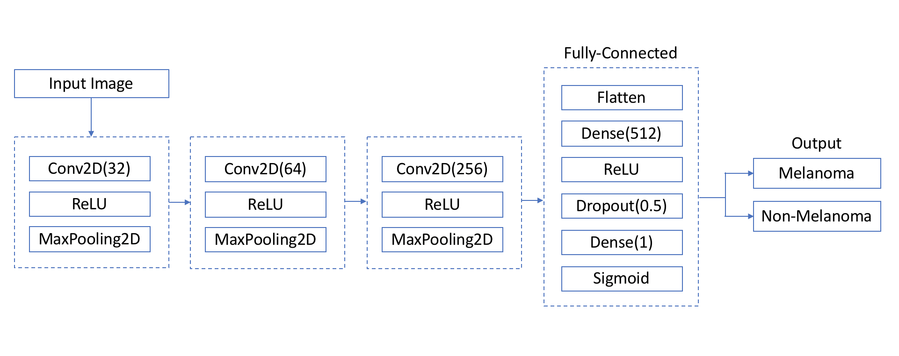
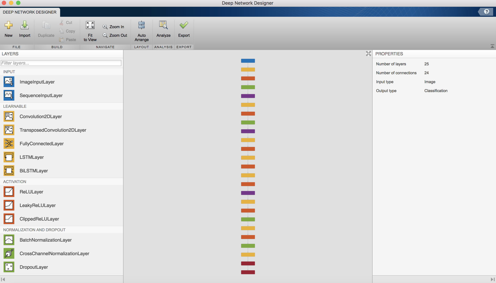
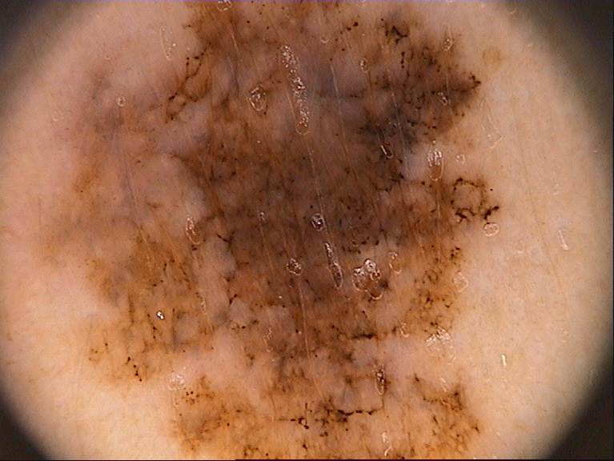
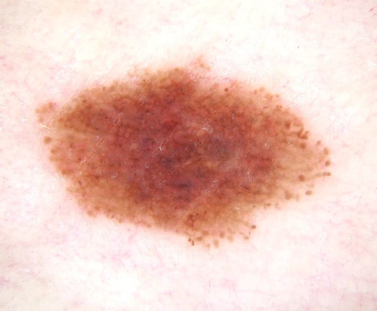
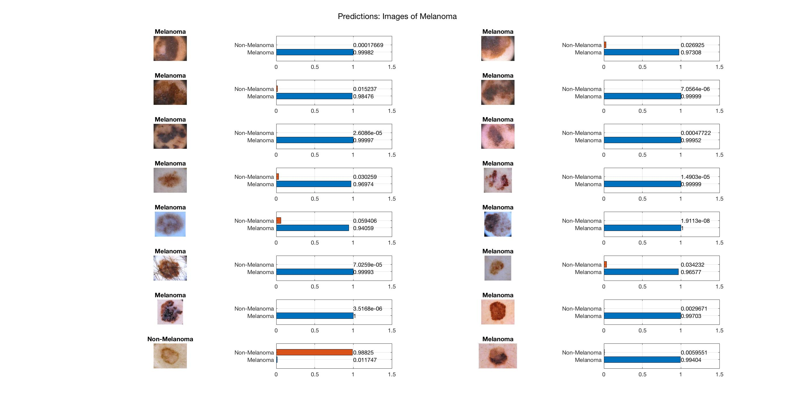
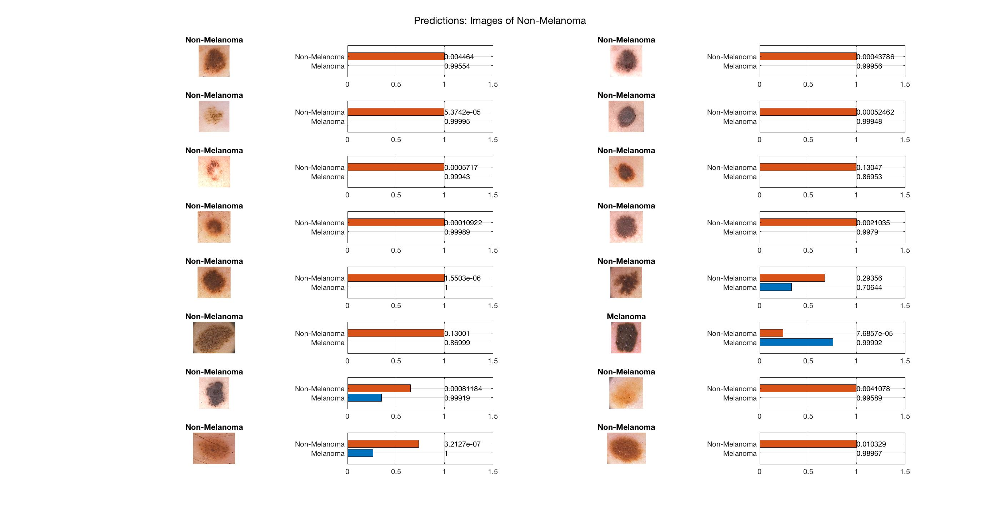

# Melanoma Detection via Convolutional Neural Network (CNN)

The objective of this project is to create a Convolutional Neural Network (CNN) to classify a dermoscopic image of a skin lesion as Melanoma or Non-Melanoma. A dermoscopic image is a picture of the skin using a microscope and illumination.

## Motivation

Melanoma is the deadliest and most aggressive form of skin cancer; it is projected that in 2018, Melanoma of the skin will cause 9,320 deaths in the United States. However, if Melanoma is caught in an early stage, the 5-year survival rate is about 99%. Therefore, the early detection of Melanoma, before metastasis, is critical for patient survival.

Melanoma evolves from the rapid growth of melanin-producing cells, Melanocytes, which are located in the skin’s epidermis. Although Melanoma can only be confirmed with a biopsy, it is often identified visually in an existing or new nevus (commonly known as "mole") using the mnemonic “ABCDEs”:

1.    _Asymmetry_ – The lesion is irregular, or not symmetrical, in shape.
2.    _Border_ – The edges are irregular and difficult to define.
3.    _Color_ – More than one color, or uneven distribution of color, exists.
4.    _Diameter_ – Diameter is greater than 6 mm.
5.    _Evolving_ – The lesion has changed in color and size over time.

## Built With

* TensorFlow
* Keras
* Python
* MATLAB's Deep Learning Toolbox

## Models

Two CNN architectures were explored for this project:

1) Simple CNN built from scratch with Keras, TensorFlow, and Python.
2) Deep (AlexNet-based) CNN built with MATLAB's Deep Learning Toolbox. Final 3 layers (Fully Connected, Softmax, and Classification Output) are adapted to my dataset.

The source code for both models may be found in /src.

The block diagram of the Keras model may be seen below.

The AlexNet CNN architecture may be seen below. AlexNet is a popular CNN that was trained on subsets of ImageNet database used in the ILSVRC-2010 and ILSVRC-2012 competitions. The ImageNet database has over 15 million labeled, high-resolution images belonging to 22,000 categories. AlexNet is 8 layers deep and can classify images into 1000 categories, such as keyboard, mouse, pencil, etc.

AlexNet was trained on millions of images. As such, its lower layers have learned rich feature detection (such as edges, blobs, etc.) while its higher layers are more task specific (such as recognizing a keyboard). For this project, I replaced the last 3 layers of AlexNet to allow the network to learn features that are specific to my objective. This is known as Transfer Learning. The modified architecture may be seen below via MATLAB's Deep Network Designer.

More information on implementing AlexNet in MATLAB may be found [here](https://www.mathworks.com/help/deeplearning/ref/alexnet.html).

## Data

Neural Networks are a form of supervised learning, so training, testing, and validation data is required. This dataset has been acquired from multiple public sources (PH2, ISIC, and HAM10000) and combined, yielding a multi-source dataset:

* [ISIC](https://isic-archive.com)
* [PH2](http://www.fc.up.pt/addi/ph2%20database.html)
* [HAM10000](https://dataverse.harvard.edu/dataset.xhtml?persistentId=doi:10.7910/DVN/DBW86T)

I visually inspected the images from these sources and selected only the high-quality and representative images to add to my dataset. In addition, I manually cropped the selected images.

Altogether, my combined dataset contains 2,148 images. This dataset is randomly split into 70% for training, 20% for testing, and 10% for validation.

My multi-scource dataset can be downloaded [here](https://drive.google.com/open?id=1VFO37HNONIY_8qWC_wmhXgjvOKcg3zJU).

The details of this dataset may be seen below.

|            | **Melanoma** | **Non-Melanoma** |
|:----------:|:--------:|:--------------:|
|    Train   |    751   |      754     |
|    Test    |    214   |      215     |
| Validation |    106   |      108     |
|    **Total**   |   1,071  |     1,077    |

- Sample images of Melanoma from the dataset:

 

- Sample images of Non-Melanoma from the dataset:

 

### Directory Structure

This directory structure for the Keras model must be as follows. This is the structure of data_keras.zip.

data /

&nbsp;&nbsp;&nbsp;&nbsp;&nbsp;&nbsp;test /

&nbsp;&nbsp;&nbsp;&nbsp;&nbsp;&nbsp;&nbsp;&nbsp;&nbsp;&nbsp;&nbsp;&nbsp;melanoma /

&nbsp;&nbsp;&nbsp;&nbsp;&nbsp;&nbsp;&nbsp;&nbsp;&nbsp;&nbsp;&nbsp;&nbsp;non-melanoma /

&nbsp;&nbsp;&nbsp;&nbsp;&nbsp;&nbsp;train /

&nbsp;&nbsp;&nbsp;&nbsp;&nbsp;&nbsp;&nbsp;&nbsp;&nbsp;&nbsp;&nbsp;&nbsp;melanoma /

&nbsp;&nbsp;&nbsp;&nbsp;&nbsp;&nbsp;&nbsp;&nbsp;&nbsp;&nbsp;&nbsp;&nbsp;non-melanoma /

&nbsp;&nbsp;&nbsp;&nbsp;&nbsp;&nbsp;validation /

&nbsp;&nbsp;&nbsp;&nbsp;&nbsp;&nbsp;&nbsp;&nbsp;&nbsp;&nbsp;&nbsp;&nbsp;melanoma /

&nbsp;&nbsp;&nbsp;&nbsp;&nbsp;&nbsp;&nbsp;&nbsp;&nbsp;&nbsp;&nbsp;&nbsp;non-melanoma /

The directory structure for the MATLAB AlexNet model must be as follows:

data /

&nbsp;&nbsp;&nbsp;&nbsp;&nbsp;&nbsp;Melanoma /

&nbsp;&nbsp;&nbsp;&nbsp;&nbsp;&nbsp;Non-Melanoma /

## Results

### Keras CNN

The CNN built in Keras is able to achieve an overall accuracy of 78.8% on testing data not exposed to the CNN during training. This is actually good for such a simple CNN. This model takes about 10 minutes (12 epochs) to train on my MacBook Pro. While this CNN is simple and straightforward to understand, it does not yield the same level of accuracy as a deeper CNN. Below shows the accuracy, sensitivity, and specificty on the testing data.

|   Accuracy  | 78.8 |
|:-----------:|:-:|
| Sensitivity | 69.2 |
| Specificity | 88.3 |

### AlexNet-Based CNN

The deep, AlexNet-based CNN is able to achieve an overall accuracy of 90.2% on testing data not exposed to the CNN during training. This takes quite a long time to run (30 epochs). Below shows the accuracy, sensitivity, and specificty on the testing data.

|   Accuracy  | 90.2 |
|:-----------:|:-:|
| Sensitivity | 89.2 |
| Specificity | 91.2 |

Below are AlexNet-based model predictions (and associated probability) on images on Melanoma and Non-Melanoma. As you can see, this model classifies images very well.

## Author

**Laura Kocubinski** [laurakoco](https://github.com/laurakoco)

## Acknowledgments

* Boston University MET Master Science Computer Science Program
* MET CS 767 Machine Learning

# melanoma_detection_ml
